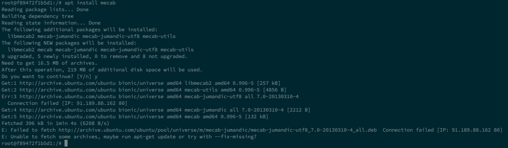
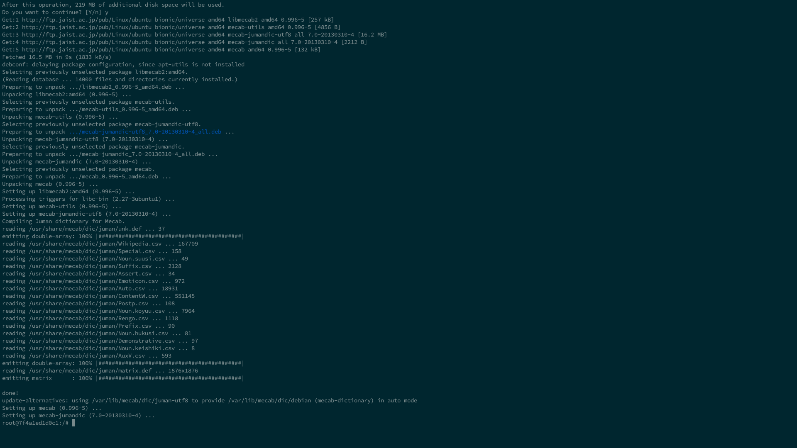

## 機械学習環境の移行をしたいでござる


現環境: nvidia/cuda:10.0-cudnn7-devel-ubuntu16.04


```shell
docker pull nvidia/cuda:10.0-cudnn7-devel-ubuntu16.04
```


↑を走らせて

Dockerfileを作成してゴニョゴニョしてしてたんですが……

- python2のサポートが切れる

- Ubuntu16.04のサポート期限はすぐにではないが近づいている

- Ubuntu16.04のpython3.6パッケージは**公式リポジトリに無い**(PPAで入れれば行ける

- Ubuntu16.04先輩にpyenvに入れて運用するのはダルいのでは？

  

Ubuntu18.0.4に上げないとまずくなってきたので

上げることに……

`nvidia/cuda:10.0-cudnn7-devel-ubuntu16.04`

から

`nvidia/cuda:10.0-cudnn7-devel-ubuntu18.04`

にdockerfileのFROM の部分変えれば終わりと思いきや

ところがどっこい

```shell
apt install mecab
```




`mecab-jumandic-utf8_7.0-20130310-4_all.deb`　の応答がない…...

試しにimageを16.04 に戻して

```shell
apt install mecab
```

を実行．

普通にinstallに成功している


結論

**うん，リポジトリの方で問題が起きている！こっちではどうしようもないな！**


 ということで


## パッケージアーカイブミラー設定


パッケージアーカイブミラーを設定してapt installの向き先を変えます．

`/etc/apt/sources.list`ファイルを開けば

↓こんな感じのが出るはず

```shell
# See http://help.ubuntu.com/community/UpgradeNotes for how to upgrade to
# newer versions of the distribution.
deb http://archive.ubuntu.com/ubuntu/ bionic main restricted
# deb-src http://archive.ubuntu.com/ubuntu/ bionic main restricted

## Major bug fix updates produced after the final release of the
## distribution.
deb http://archive.ubuntu.com/ubuntu/ bionic-updates main restricted
# deb-src http://archive.ubuntu.com/ubuntu/ bionic-updates main restricted

## N.B. software from this repository is ENTIRELY UNSUPPORTED by the Ubuntu
## team. Also, please note that software in universe WILL NOT receive any
## review or updates from the Ubuntu security team.
deb http://archive.ubuntu.com/ubuntu/ bionic universe
# deb-src http://archive.ubuntu.com/ubuntu/ bionic universe
deb http://archive.ubuntu.com/ubuntu/ bionic-updates universe
# deb-src http://archive.ubuntu.com/ubuntu/ bionic-updates universe

## N.B. software from this repository is ENTIRELY UNSUPPORTED by the Ubuntu
## team, and may not be under a free licence. Please satisfy yourself as to
## your rights to use the software. Also, please note that software in
## multiverse WILL NOT receive any review or updates from the Ubuntu
## security team.
deb http://archive.ubuntu.com/ubuntu/ bionic multiverse
# deb-src http://archive.ubuntu.com/ubuntu/ bionic multiverse
deb http://archive.ubuntu.com/ubuntu/ bionic-updates multiverse
# deb-src http://archive.ubuntu.com/ubuntu/ bionic-updates multiverse

## N.B. software from this repository may not have been tested as
## extensively as that contained in the main release, although it includes
## newer versions of some applications which may provide useful features.
## Also, please note that software in backports WILL NOT receive any review
## or updates from the Ubuntu security team.
deb http://archive.ubuntu.com/ubuntu/ bionic-backports main restricted universe multiverse
# deb-src http://archive.ubuntu.com/ubuntu/ bionic-backports main restricted universe multiverse

## Uncomment the following two lines to add software from Canonical's
## 'partner' repository.
## This software is not part of Ubuntu, but is offered by Canonical and the
## respective vendors as a service to Ubuntu users.
# deb http://archive.canonical.com/ubuntu bionic partner
# deb-src http://archive.canonical.com/ubuntu bionic partner

deb http://security.ubuntu.com/ubuntu/ bionic-security main restricted
# deb-src http://security.ubuntu.com/ubuntu/ bionic-security main restricted
deb http://security.ubuntu.com/ubuntu/ bionic-security universe
# deb-src http://security.ubuntu.com/ubuntu/ bionic-security universe
deb http://security.ubuntu.com/ubuntu/ bionic-security multiverse
# deb-src http://security.ubuntu.com/ubuntu/ bionic-security multiverse
```


`http://security.ubuntu.com`以外の項目を置換して

JAISTのサーバに向けることにします．


```perl
# JASIT
perl -p -i.bak -e 's%https?://(?!security)[^ \t]+%http://ftp.jaist.ac.jp/pub/Linux/ubuntu/%g' /etc/apt/sources.list
```

置換前のファイルは以下に格納されるはずです．

`/etc/apt/sources.list.bak`

変換後の設定ファイル


無事成功



